<!-- .slide: data-background="lec2/cover.png" -->

<!--s-->
<!-- .slide: data-background="lec2/background.png" -->

# Part.1 文件基础

<!--v-->
<!-- .slide: data-background="lec2/background.png" -->

## 文件是什么？文件类型如何识别

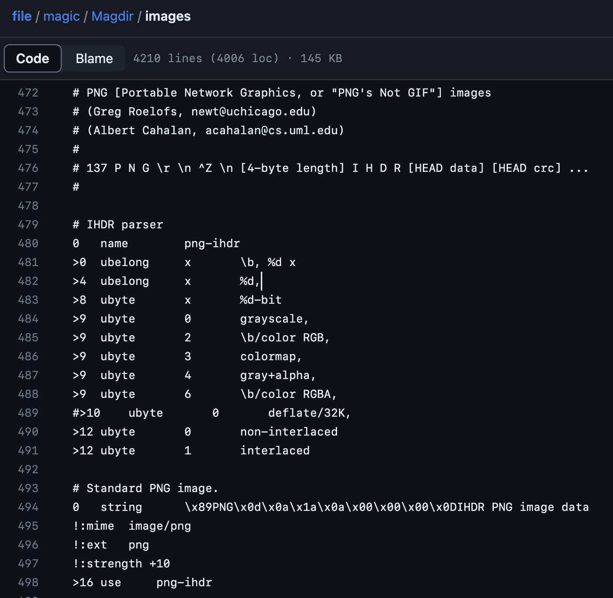

- 文件就是一段二进制数据
- 操作系统一般不会记录文件的类型

如何识别文件的类型？

- 扩展名？
    - .jpg .png .txt .docx .pdf .zip ……
    - 但是扩展名可以随意修改
    - 扩展名只决定了打开文件的默认程序
- 文件内容
    - 通过文件内容来识别文件类型是最可靠的
    - file 命令的原理（magic file）
    - 一般常见的文件类型都有固定的**文件头**
        - 又称为 magic number

<!--v-->
<!-- .slide: data-background="lec2/background.png" -->

## 十六进制查看文件与分析

一些工具推荐：

- [010 Editor](https://www.sweetscape.com/010editor/)
    - 全平台最常用的二进制编辑器
    - 有丰富的 Binary Templates，支持解析多种文件格式
    - 缺点是付费（但可以破解）
- [wader/fq](https://github.com/wader/fq)
    - 全平台、免费开源的二进制格式解析工具
    - 支持类似 jq 语法的查询
- [Hex Fiend](https://hexfiend.com/)
    - macOS 上免费开源高效的二进制编辑器
    - 也有多种二进制格式的解析模板，但显示没有 010 丰富

<!--v-->
<!-- .slide: data-background="lec2/background.png" -->

## 文件类型检测与元信息

常见文件头 hex：

| 文件类型 | 文件头 | 对应 ASCII |
| :---: | :--- | :--- |
| JPEG | FF D8 FF | ... |
| PNG | 89 50 4E 47 0D 0A 1A 0A | .PNG.... |
| GIF | 47 49 46 38 39 61 | GIF89a |
| PDF | 25 50 44 46 | %PDF |
| ZIP | 50 4B 03 04 | PK.. |
| RAR | 52 61 72 21 | Rar! |
| 7z | 37 7A BC AF 27 1C | 7z..' |
| MP3 | 49 44 33 | ID3 |

- 通过 file 命令进行文件类型的检测
- 可以使用 exiftool 读取大部分文件的元信息

<!--v-->
<!-- .slide: data-background="lec2/background.png" -->

## 文件附加内容的识别与分离

- 大部分文件类型都有一个标记文件内容结束的标志
    - 比如 PNG 的 IEND 块、JPEG 的 EOI 标志（FF D9）
- 所以一般在文件末尾添加其他字节时，不会影响原文件本身的用途
    - 因此有些隐写是将数据隐藏在文件末尾达到的
    - 或者在文件后叠加另一份文件
- 附加内容的识别
    - exiftool 一般可以识别图片文件后的附加数据
    - binwalk 可以检测叠加的文件
- 附加文件的分离
    - binwalk -e *<file\>* 即可识别并分离出附加的文件（可能会不好用）
    - foremost *<file\>* 也可以识别并分离出附加的文件
    - dd if=*<src\>* of=*<dst\>* bs=1 skip=*<offset\>* 手动分离

<!--s-->
<!-- .slide: data-background="lec2/background.png" -->

# Part.2 图片文件格式

<!--v-->
<!-- .slide: data-background="lec2/background.png" -->

## 图片文件需要存储什么？

- 图片信息：
    - 宽度、高度、其他元信息
- 像素数据：
    - 比如 RGB 三通道，需要存储每个像素的 R、G、B 值
    - 假设每个像素 8 位，那么每个像素需要 24 位
    - 这样的话一张 1920x1080 的图片至少需要 6MB，4K 图片需要 24MB

所以图片文件存储的重点在于如何**压缩**图片数据

两种压缩图片的方式：

- 无损压缩：可以完全一点不差地恢复原图，比如 PNG
- 有损压缩：会丢失一些信息，但对视觉效果影响不非常大，比如 JPEG

<!--v-->
<!-- .slide: data-background="lec2/background.png" -->

## 色彩空间、色彩模式

色彩空间（sRGB、Adobe RGB、P3 等）是一个相对非常复杂的概念，而且是针对显示的，我们不详细介绍。

我们注重于表示颜色的数据上，一般称为色彩模式（color mode）：

- 二值图像（bitonal）：每个像素只有两种颜色，比如黑白图像
- 灰度图像（grayscale）：每个像素有多种灰度，比如 256 级灰度
- RGB[A]：三/四通道，表示红、绿、蓝三种颜色，A 表示透明度通道
- CMYK：青 cyan、品红 magenta、黄 yellow、黑 black 四种颜色混合
- HSV：色调 hue、饱和度 saturation、明度 value
- YCbCr：亮度 luminance、蓝色色度 blue chroma、红色色度 red chroma
- LAB：亮度 lightness、绿红色度 A、蓝黄色度 B
- ...

<!--v-->
<!-- .slide: data-background="lec2/background.png" -->

## JPEG 文件格式

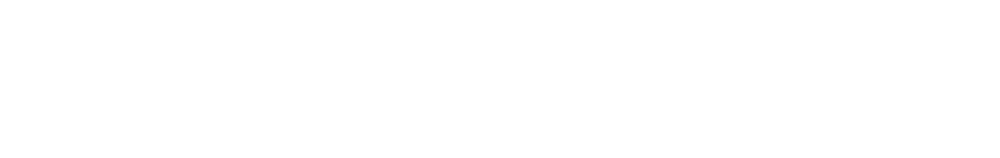

JPEG 使用分段的结构来进行存储，各段以 0xFF 开头，后接一个字节表示类型：

- FFD8（SOI）：文件开始
- FFE0（APP0）：应用程序数据段，包含文件格式信息（上图没有）
- FFE1（APP1）：应用程序数据段，包含 Exif 信息（上图没有）
- FFDB（DQT）：量化表数据
- FFC0（SOF）：帧数据，包含图像宽高、色彩模式等信息
- FFC4（DHT）：哈夫曼表数据
- FFDA（SOS）：扫描数据，包含数据的扫描方式，哈夫曼表的使用方式等
- FFD9（EOI）：文件结束

<!--v-->
<!-- .slide: data-background="lec2/background.png" -->

## JPEG 格式压缩原理 - YUV 重采样

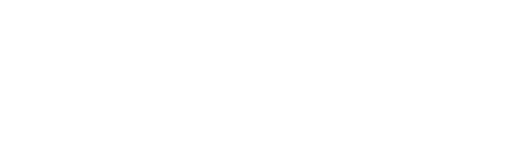

- Y 亮度，UV 分别表示蓝色、红色色度（YCbCr）
- 研究结论：人眼对亮度更敏感
    - 所以可以降低 UV 分量的采样率，减少数据量
- RGB 和 YUV 之间有一个较为复杂的转换公式

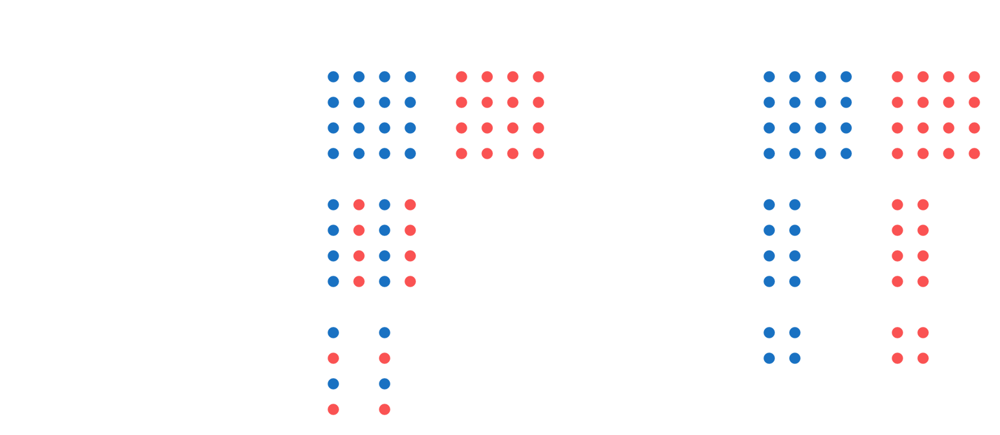

<!--v-->
<!-- .slide: data-background="lec2/background.png" -->

## JPEG 格式压缩原理 - DCT 变换

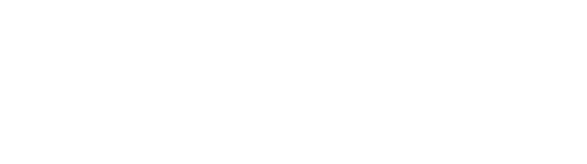

- 研究结论：人眼对低频信息比高频敏感
    - 通过 DCT 将图像转为频域，便于后续压缩高频
- DCT 变换（离散余弦变换）：将离散信号转换为一组余弦函数的加权和
    - 一维 DCT：$X_k = \sum_{n=0}^{N-1} x_n \cos \left( \frac{\pi}{N} \left( n + \frac{1}{2} \right) k \right)$
    - 是完全可逆的，可以通过 IDCT 变换恢复原信号（无损）
- 这一步将图片划分为 8x8 的小块，每个值减 128
    - 每块进行二维 DCT 变换
    

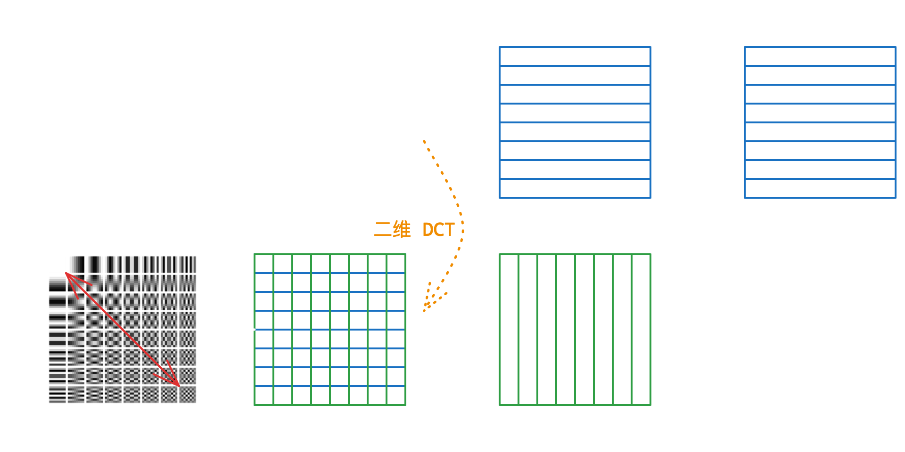

<!--v-->
<!-- .slide: data-background="lec2/background.png" -->

## JPEG 格式压缩原理 - 量化

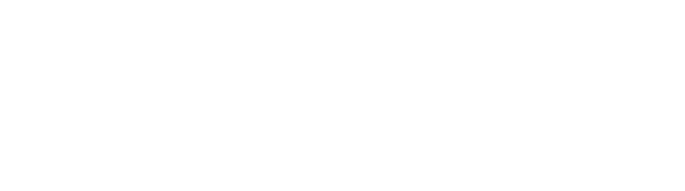

- 继续使用上页对高频不敏感的结论
    - 直接在这一步对高频进行压缩
    - 通过量化矩阵将高频系数缩小，更多出现冗余，有利于游程编码进行压缩
- 根据不同压缩质量选择不同的量化矩阵，编码时除，解码时乘
    - 乘除法时进行取整，因此这里会有损

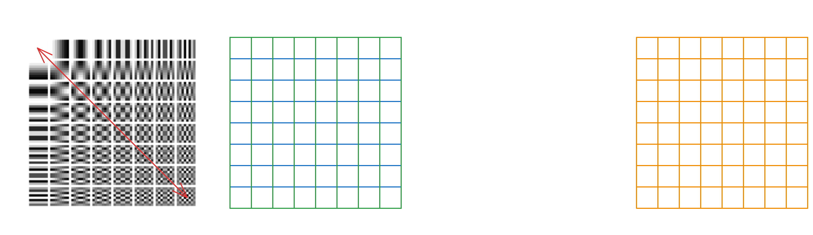

<!--v-->
<!-- .slide: data-background="lec2/background.png" -->

## JPEG 格式压缩原理 - Huffman 编码

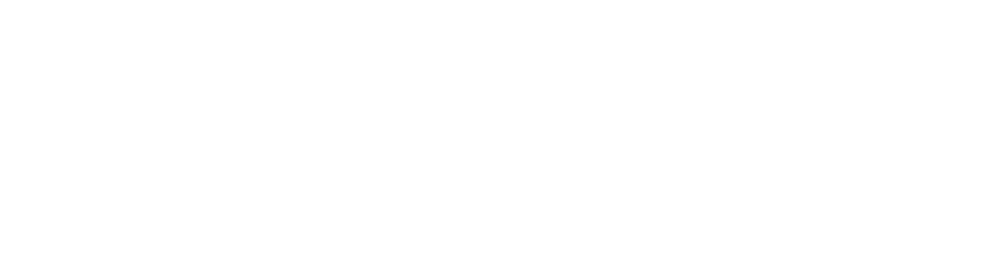

- 这里我将两步并为一步来说了
    - 先进行游程编码合并冗余信息
    - 再进行**范式** Huffman 编码，进一步压缩
- 游程编码：连续出现的数值记录一个以及出现次数
- 范式 Huffman 编码
    - **范式**体现在根据长度和对应长度的编码个数，就可以推算编码
    - 同一长度的编码连续
    - 长度 *j* 的第一个编码为长度  
      *j-1* 的最后一个编码加一左移动一位

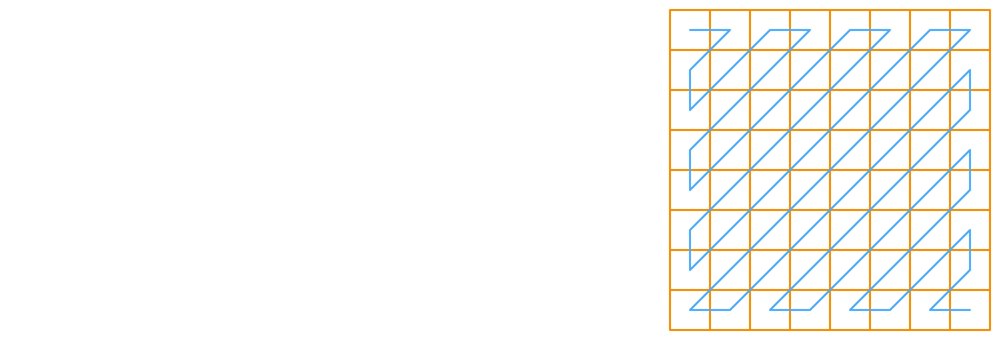

<!--s-->
<!-- .slide: data-background="lec2/background.png" -->

# Part.2 图片文件格式（续）

<!--v-->
<!-- .slide: data-background="lec2/background.png" -->

## PNG 文件格式

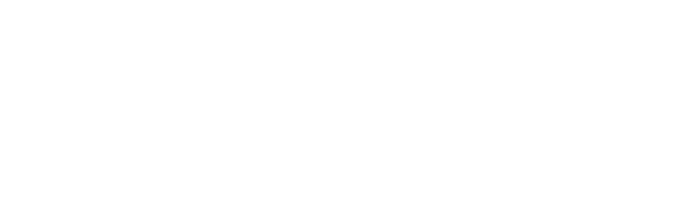

- 文件头 89 50 4E 47 0D 0A 1A 0A | .PNG....
- 采用分块的方式存储数据
    - 每块的结构都是 4 字节长度 + 4 字节类型 + 数据 + 4 字节 CRC 校验
    - 四个标准数据块：IHDR、PLTE、IDAT、IEND
    - 其他辅助数据块：eXIf、tEXt、zTXt、tIME、eXIf、……
        - eXIf 元信息，tIME 最后时间，tEXt 文本，zTXt 压缩文本

<!--v-->
<!-- .slide: data-background="lec2/background.png" -->

## PNG 文件格式（续）

四个标准数据块：

- IHDR：包含图片基本信息，必须位于开头
    - 4 字节宽度 + 4 字节高度
    - 1 字节位深度：1、2、4、8、16
    - 1 字节颜色类型：0 灰度，2 RGB，3 索引，4 灰度+透明，6 RGB+透明
    - 1 字节压缩方式固定 0、1 字节滤波方式固定 0
    - 1 字节扫描方式：0 非隔行扫描，1 Adam7
- PLTE：调色板，只在索引颜色类型时使用，留给同学们自行研究
- IDAT：图片数据，可以有多个，每个数据块最大 2^31-1 字节
- IEND：文件结束标志，必须位于最后，内容固定

<!--v-->
<!-- .slide: data-background="lec2/background.png" -->

## PNG 格式压缩原理 - Deflate 算法

- Deflate 算法是一种无损压缩算法，也是 zip gzip 等压缩算法的基础
- 思路是利用字节序列中重复出现的冗余信息
- 具体算法是 LZ77 + Huffman 编码，Huffman 编码还是不详细解释
    - LZ77 的思路大致如下，利用滑动窗口来记录并搜索，替代冗余序列

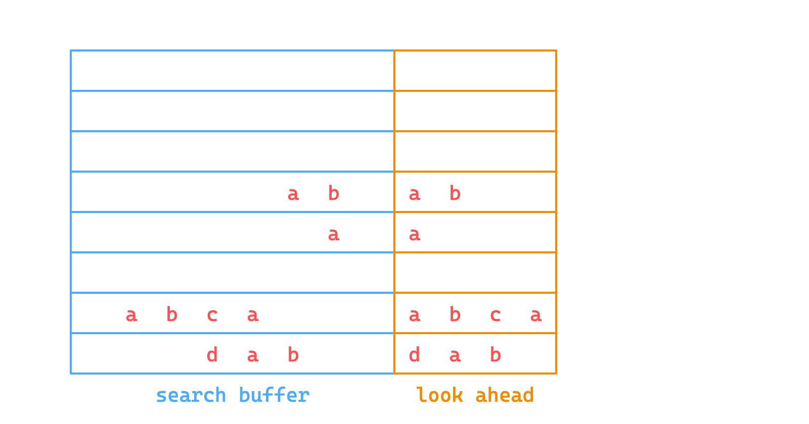

<!--v-->
<!-- .slide: data-background="lec2/background.png" -->

## PNG 格式压缩原理 - 滤波（filtering）

- PNG 会将图片每一行进行 deflate 压缩，但思考一种情况：
    - 像素值依次为 8 10 12 14 ... 时，压缩就完全没有效果
- 引入了滤波步骤，其中一种滤波器就将上述情况变为了 8 2 2 2 ...
- 每一行可以选择自己的滤波器
    - 会记录类型压缩到数据中
    - 计算都是在模 256 下的
- 自适应算法选择最优滤波器
    - 先使用全部滤波器，不模 256
    - 选择整行结果和最小的一个滤波器
    - 没有理论依据，但是可以用

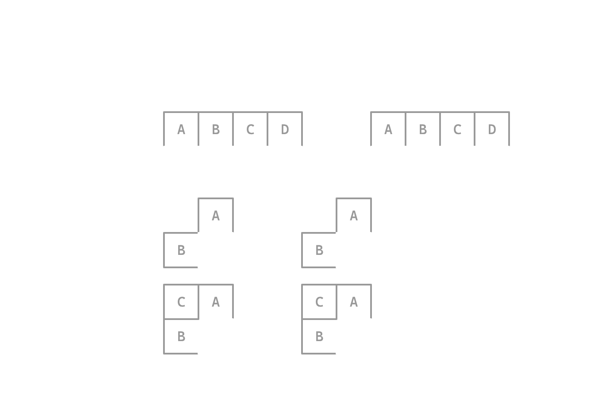

<!--v-->
<!-- .slide: data-background="lec2/background.png" -->

## 参考阅读

- JPEG
    - [The Unreasonable Effectiveness of JPEG: A Signal Pro...](https://youtu.be/0me3guauqOU)
        - Reducible 频道的视频，B 站搬运：[BV1iv4y1N7sq](https://b23.tv/BV1iv4y1N7sq)
    - [ISO/IEC 10918-1:1994](https://www.iso.org/standard/18902.html?browse=tc) official standard
    - [JPEG压缩原理与DCT离散余弦变换](https://blog.csdn.net/newchenxf/article/details/51719597)
    - [Understanding and Decoding a JPEG Image using Python](https://yasoob.me/posts/understanding-and-writing-jpeg-decoder-in-python/)
    - libjpeg 源码 [GitHub:thorfdbg/libjpeg](https://github.com/thorfdbg/libjpeg)
- PNG
    - [How PNG Works: Compromising Speed for Quality](https://youtu.be/EFUYNoFRHQI)
        - Reducible 频道的视频，B 站搬运：[BV1wY4y1P7o7](https://b23.tv/BV1wY4y1P7o7)
    - [PNG Specification (Third Edition)](https://www.w3.org/TR/png-3/)

<!--s-->
<!-- .slide: data-background="lec2/background.png" -->

# Part.3.1 图片隐写 - 基于文件内容

<!--v-->
<!-- .slide: data-background="lec2/background.png" -->

## 回顾文件内容基本隐写

- 文件末尾添加数据
    - exiftool 识别短数据，或者十六进制编辑器直接观察
    - binwalk 识别叠加文件，foremost 提取
    - 图片末尾叠加一个压缩包，就是所谓的“图种”
        - 修改后缀名可能可以解压（部分解压软件会忽略前面的图片）
        - 其实不如直接分离
- 直接利用元信息
    - exiftool 即可读取

<!--v-->
<!-- .slide: data-background="lec2/background.png" -->

## 图片大小修改

- PNG 图片按行进行像素数据的压缩，以及存储/读取
- 当解码时已经达到了 IHDR 中规定的大小就会结束
- 因此题目可能会故意修改 IHDR 中的高度数据，使之显示不全
- 恢复的话更改高度即可，同时注意 crc 校验码，否则可能报错
    - binascii.crc32(data)，data 为从 IHDR 开始的数据

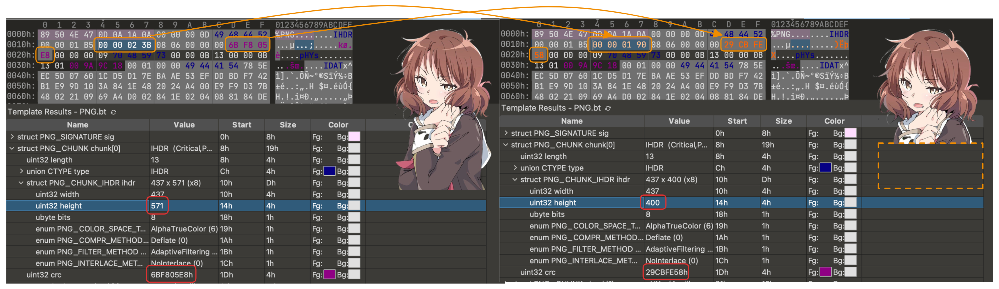

<!--v-->
<!-- .slide: data-background="lec2/background.png" -->

## 更多图片文件内容隐写手段

还有更多基于文件内容的隐写方式我们就不展开讲了，这里介绍一些可能的：

- 人为隐写
    - JPEG 中 DCT 系数可以进行 LSB 隐写
    - JPEG 中 DHT 定义的哈夫曼表可能有冗余项，可以隐写
        - 本次 lab 中有一道这样的题目，需要大家自行研究 DHT 格式
    - PNG 中附加多余 IDAT 数据块的隐写（显示时被忽略）
    - PNG 中使用调色盘时可以进行调色盘隐写（EZStego 隐写）
        - 本次 lab 中也有一道这样的题目，需要大家自行研究一下 EZStego
- 较成熟的工具隐写
    - steghide、stegoveritas、SilentEye 等
    - 一般找到了类似密码一类的大概率是工具题

<!--s-->
<!-- .slide: data-background="lec2/background.png" -->

# Part.3.2 图片隐写 - 基于视觉像素

<!--v-->
<!-- .slide: data-background="lec2/background.png" -->

## PIL 图片处理基础

PIL（Python Imaging Library）是 Python 中非常常用的图片处理库。

- pip install pillow 安装
- 官方文档，有教程：https://pillow.readthedocs.io/en/stable/
    - 除此之外想要灵活使用可能还需要一点 numpy 的基础
- 基本用法
    - from PIL import Image，导入和图片读写处理有关的 Image 类
    - img = Image.open(file_name) 打开图片
    - img.show() 显示图片；img.save(file_name) 保存图片
    - img.size 图片大小，img.mode 图片模式
    - img.convert(mode) 转换图片模式
    - img.getpixel((x, y)) 获取像素点颜色
    - img.putpixel((x, y), color) 设置像素点颜色
    - np.array(img) 将图片转换为 numpy 数组

<!--v-->
<!-- .slide: data-background="lec2/background.png" -->

## PIL 图片处理基础（续）

- 具体图片模式以及转换
    - "1"：黑白二值（0/255）；"L"：灰度（8bit），"l"：32bit 灰度
        - $\mathtt{L} = \frac{299}{1000}\mathtt{R} + \frac{587}{1000}\mathtt{G} + \frac{114}{1000}\mathtt{B}$
    - "P"：8bit 调色盘，获取的像素值是调色盘索引
    - "RGB"、"RGBA" 不多说了
    - "CMYK"：转换时有色差，CMY = 255 - RGB，K = 0
    - "YCbCr"、"LAB"、"HSV" 等，转换时有复杂公式（可能出现新的隐写）
- PIL 其他模块用途
    - ImageDraw 用于绘制图片、绘制图形
    - ImageChops 用于图片通道的逻辑运算
    - ImageOps 用于图片整体的运算一类
    - ImageFilter 用于图片的滤波处理

<!--v-->
<!-- .slide: data-background="lec2/background.png" -->

## LSB 隐写

- LSB：Least Significant Bit，最低有效位
- 隐写原理：人眼对于 8 bit 色值低位的颜色变化（+1/-1）并不敏感
    - 可以随意修改低位，而不影响图片的显示效果

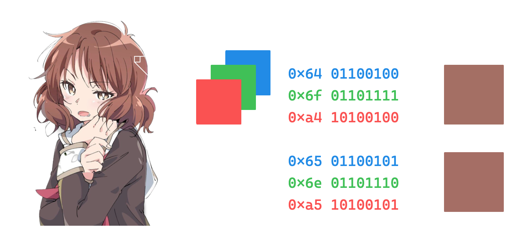

- 做法：
    - 图片：stegsolve / CyberChef View Bit Plane
    - 数据：stegsolve data extractor / CyberChef Extract LSB
        - 猜测参数：zsteg -a *<image\>*
        - zsteg 提取：zsteg -E '1b,bgr,lsb' *<image\>* > *<output\>*

<!--v-->
<!-- .slide: data-background="lec2/background.png" -->

## 幻影坦克

- 一种在黑底和白底下显示不同图像的隐写方式
- 使图片带有预先设定好的颜色和透明度，使得在不同背景下颜色混出不同的结果
- 以灰阶图像为例（效果最好）
    - 假设混合后图片某像素点的颜色为 $(x, \alpha)$，那么混合背景的公式
        - $x' = x\alpha + x_{bg}(1-\alpha)$，混合后该像素点颜色为 $(x', 1)$
        - 白底（255）：$x_{\text{white}} = x\alpha + 255(1-\alpha) = 255 - (255-x)\alpha$
        - 黑底（0）：$x_{\text{black}} = x\alpha + 0(1-\alpha) = x\alpha$
    - 反过来计算（构造），求解方程组
        - $\alpha = 255 - x_{\text{white}} + x_{\text{black}}$
            - $\alpha \leq 255\Rightarrow x_{\text{black}}-x_{\text{white}} \leq 0$，可能需要调亮度
        - $x = x_{\text{black}} / \alpha$

<!--v-->
<!-- .slide: data-background="lec2/background.png" -->

## 需要原图的图片隐写

有些情况下的图片隐写需要原图才能解密，这时第一步一般是 OSINT 搜索原图

- 使用识图工具进行搜索
- 一般需要搜原图的题题目描述会带有来源暗示之类的
- 多注意搜到的图片大小、质量，确保是真正的原图

接下来利用原图和隐写图片的差异进行分析

- 图片像素异或观察差异
    - PIL 手动处理/ ImageChops.difference
    - stegsolve image combiner
- 盲水印系列
    - 给了打水印的代码的话直接尝试根据代码逆推即可
    - 没有给代码的可能就是常见的现有盲水印工具
        - [guofei9987/blind_watermark](https://github.com/guofei9987/blind_watermark)

<!--s-->
<!-- .slide: data-background="lec2/background.png" -->

# Part.4 音频格式简要介绍与隐写

<!--v-->
<!-- .slide: data-background="lec2/background.png" -->

## 音频文件格式简介

音频类题目其实并不常出，遇到了基本也就是两种格式：

- mp3：有损压缩
    - 具体格式不多介绍，遇到了基本上也就是声音本身的隐写
- wav：无损压缩（waveform）
    - 直接存储的是音频的波形数据，可操作性更高
    - 文件结构也是分 chunk 的，有 RIFF、fmt、data 等
    - fmt sub-chunk 记录了音频的格式信息，data 是具体数据，fmt 包含：
        - NumChannels 通道数
        - SampleRate 采样率
        - BitsPerSample 采样位数
        - BlockAlign 每个采样的字节数
        - ...

<!--v-->
<!-- .slide: data-background="lec2/background.png" -->

## wav 文件读取及数据处理

由于 wav 文件直接存储了音频波形，所以可以更灵活地读取、处理数据

- 不建议使用 python 的 wave 包，读取的结果比较混乱
- 推荐使用 scipy 的功能，from scipy.io import wavefile
    - samplerate, data = wavefile.read(*<file_name\>*)
    - data 是 numpy 数组，每一行是一个采样点，每一列是一个通道
    - 通道数 = data.shape[1]
    - 音频长度由采样率决定，data.shape[0] / samplerate（单位秒）
    - data[:, 0] 即为第一个通道的数据（numpy fancy indexing）
- 读取每个采样点的数据之后就可以进行进一步的处理了
    - 也可以配合 matplotlib 进行可视化等

<!--v-->
<!-- .slide: data-background="lec2/background.png" -->

## wav 的 LSB 隐写

- 由于 wav 无损存储采样点的波形数据，所以也可以进行 LSB
- 对每个采样点数据的最低有效位进行读取/修改就可以完成
    - data[:, 0] & 1 可以得到第一个通道的 LSB
    - 提取 LSB 后再进一步处理 01 串就可以了
- 有现成的利用工具的 wav LSB 隐写
    - 使用 SilentEye 软件，即可以直接读取隐藏的信息

<!--v-->
<!-- .slide: data-background="lec2/background.png" -->

## 频谱隐写

接下来的一些隐写方式都不依赖于无损格式，只要能听就能尝试

一般使用 Adobe Audition 打开来进行进一步的分析

- 频谱隐写是观察音频的频谱图，可能会有部分信息经过了调整
- 比如如下攻防世界的一道题目 Hear with your eyes

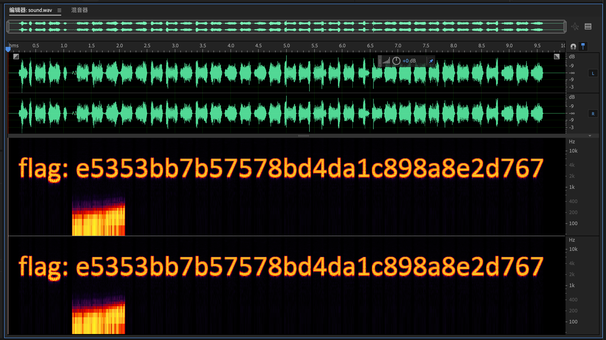

<!--v-->
<!-- .slide: data-background="lec2/background.png" -->

## 音频叠加

- 如果可以找到原音频，或提供了原音频，可以进行比较
- 方法是在 Audition 中创建多轨会话
    - 将两个音频拖入两个轨道
    - 效果 > 匹配响度，将两条音轨的响度匹配
    - 点进其中一条音轨，效果 > 反相，将波形上下颠倒
    - 两条音轨匹配上波形之后播放/混音，就能听到差异了

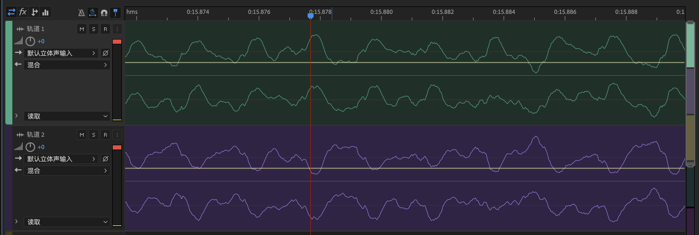

<!--v-->
<!-- .slide: data-background="lec2/background.png" -->

## SSTV

- SSTV：Slow Scan Television，慢扫描电视
- 一种通过无线电进行图像传输的技术，可以进行图片和音频的转换
- 特征是有明显规律开头的一段噪声
- 有很多现成的软件来解读这样的音频
    - 比如手机上软件 Robot36（手机内部播放效果更好）
    - 电脑上 MMSSTV、RX-SSTV 等

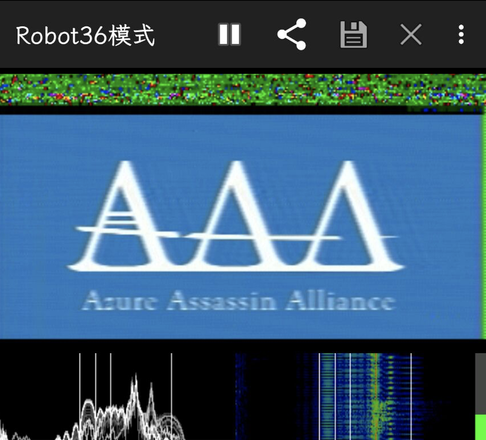

<!--s-->
<!-- .slide: data-background="lec2/background.png" -->

## misc 专题一 Lab 简介

[courses.zjusec.com/topic/misc-lab2](https://courses.zjusec.com/topic/misc-lab2/)，三个必做，三个选做

- 必做部分：
    - Challenge 1: songmingti（20 分）
    - Challenge 2: miaomiaomiao（20 分）
    - Challenge 3: easy LSB（20 分）
- 选做部分，分数见下，整体多出 100 分的为 bonus
    - Challenge 4: Palette Stego（20 分）
        - 之前提到的 PNG 调色板隐写，详见实验手册
    - Challenge 5: Spectrogram（30 分）
        - 一个逆推音频转频谱程序的题目
    - Challenge 6: Huffman Tree（50 分）
        - 之前提到的冗余 Huffman 编码隐写题目，挑战较大，详见实验手册

<!--s-->
<!-- .slide: data-background="lec2/ending.png" -->