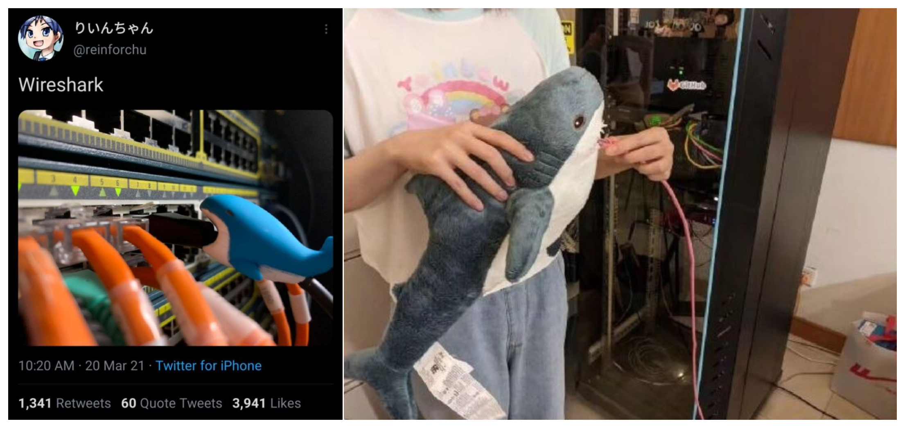

<!-- .slide: data-background="lec3/cover.png" -->

<!--s-->
<!-- .slide: data-background="lec3/background.png" -->

# Part.1 流量取证

<!--v-->
<!-- .slide: data-background="lec3/background.png" -->

## 流量取证基础

- 网络流量（-> 回顾 web 专题一）
    - 应用层（HTTP/FTP/...）-> 表示层 -> 会话层（SSL/TLS/...）
    - -> 传输层（TCP/UDP）-> 网络层（IP/ICMP/...）
    - -> 数据链路层 -> 物理层
- 最终传输的仍然是我们一直在讲的二进制数据
    - 捕获这些数据，就可以分析得到正在进行的通信内容
- 流量取证一般就是拿到这些数据包（cap、pcap、pcapng 格式）进行分析
    - 如有损坏的话修复数据包（少见，pcapfix 可以修复）
    - 分析、提取得到正在通信的内容（可能包含有效信息）
    - 分析一些特定的、不太常见的协议（比如一些自定义协议）
    - 分析、解密一些加密的协议（比如 VMess 等）

<!--v-->
<!-- .slide: data-background="lec3/background.png" -->

## 流量取证常用工具

- tcpdump 抓 TCP 包（Linux 命令行）
- 🌟 [Wireshark](https://www.wireshark.org/)：直接抓包，得到物理层的全部数据并解析（开源）
    - 自带命令行工具 tshark
- [termshark](https://github.com/gcla/termshark)：类似 Wireshark 的开源命令行工具
- [pyshark](https://github.com/KimiNewt/pyshark/)：tshark 的 Python 封装，可以用 Python 脚本分析
- [scapy](https://scapy.net/)：Python 库，也可以用来分析流量包

<!--v-->
<!-- .slide: data-background="lec3/background.png" -->

## Wireshark 基本用法

- 浏览主界面的所有数据包，大致了解都由什么协议组成
- 追踪流（追踪 TCP 流/追踪 HTTP 流）
    - 得到某次通信的全部数据包，并进行解析
    - 另存为，保存流数据
    - 可以转换不同的显示形式（ASCII、HEX、Raw）
- 文件 > 导出，提取某些数据包的流内容
- 统计部分
    - 协议层次：统计各层协议的数据包数量
    - 流量图：统计各个端口的流量，可视化显示
    - HTTP：分组计数、请求统计

<!--v-->
<!-- .slide: data-background="lec3/background.png" -->

## Wireshark 过滤器

- 过滤协议：直接输入 tcp/udp/http 等
- 过滤 ip：ip.addr == xx.xx.xx.xx 或 ip.src ip.dst
- 过滤端口：tcp.port == 80 或 tcp.srcport tcp.dstport
- 包长度过滤：frame.len ip.len tcp.len ……
- http 过滤
    - http.request.method == GET
    - http.request.uri == "/index.php"
    - http contains "flag"（相当于搜索功能）

<!--v-->
<!-- .slide: data-background="lec3/background.png" -->

## HTTP 协议流量分析

- 分析统计信息
    - 查看所有的 HTTP 请求 URI
    - 分析 HTTP 往返的情况，流量整体信息
- 具体分析某些请求：利用过滤器
- 分析某一数据包具体内容
    - 跟踪流，跟踪 TCP 解析 TCP，跟踪 HTTP 可以自动解压 gzip 等
    - 分析请求头、响应头、请求体、响应体等
- 具体题目示例
    - 本次 lab 中的题目：SQL 盲注流量分析

<!--v-->
<!-- .slide: data-background="lec3/background.png" -->

## UDP 协议

- UDP 协议是无连接的，不需要像 TCP 一样三次握手
- 和 TCP/HTTP 一样直接追踪分析就可以
- 常见的基于 UDP 的协议：DNS
- 具体题目示例
    - 本次 lab 中的题目：dnscap
    - MRCTF 2022：Bleach!
        - 基于 UDP 的 RTP 协议，需要手动选择进行解析
        - RTP 是一种音视频传输协议，可以得到音频流
        - wav 音频流中 LSB 包含隐写图片

<!--v-->
<!-- .slide: data-background="lec3/background.png" -->

## 其他协议

- ICMP 协议：ping
    - 某时也会带有一些信息，可以进行进一步分析
- OICQ 协议：QQ 使用，是加密的，但是可以看到双方 QQ 号等
- WIFI 协议（IEEE 802.11）
    - 可以使用 Linux aircrack 套件爆破密码
    - 有了密码后可以在 Wireshark 中设置并解密流量
- USB 协议
    - 安装了 USBcap 之后可以在 Wireshark 中捕获 USB 流量
    - 有工具可以解析流量，绘制鼠标轨迹，得到按键信息等
- 其他加密协议
    - VMess，需要读文档/源码，实现解密
    - 例题：强网杯 2022 Quals 谍影重重

<!--s-->
<!-- .slide: data-background="lec3/background.png" -->

# Part.2 内存取证

<!--v-->
<!-- .slide: data-background="lec3/background.png" -->

## 内存取证基础介绍

- 内存取证就是从内存（RAM）中找到、提取有价值的信息
    - 系统运行中会大量使用内存，内存中会包含很多信息
    - 这些信息包括运行的进程、网络连接、内核模块、打开的文件等等
- 一般这种题目都会提供一个巨大的 raw 文件
    - 大小几乎等于靶机 RAM 的大小
    - 是直接 dump 出来的 raw 内存数据
        - 利用 DumpIt（Win）、LiME（Linux）等工具可以 dump 出内存
    - Windows 的居多（利用更丰富）
    - 通过工具分析内存数据，找到有效有价值的信息

<!--v-->
<!-- .slide: data-background="lec3/background.png" -->

## 内存取证基本步骤

- 先 strings
    - 提取出文件中所有的 ASCII 字符串，没准就发现有效信息秒杀了
    - 会有超多，可以输出到文件然后搜索，或者直接 grep
        - strings mem.raw | grep "flag"
    - 提取 Unicode 字符 strings -el
- 再上 volatility
    - 开源的内存取证工具，可以分析 Windows/Linux/macOS
    - 先识别系统信息
    - 针对不同系统使用不同命令分析
        - 能跑的都跑一遍，注意看输出

<!--v-->
<!-- .slide: data-background="lec3/background.png" -->

## Volatility 基本用法

- volatility 版本
    - 2.6.1 版本，基于 python 2，最常用，功能较多
    - 3.x 版本，基于 python 3，开发中，但大部分时候其实没 2.x 好用
    - 安装比较复杂，留作 lab 给大家联系配环境（坏笑
- 查看 volatility 支持的 profile、插件等
    - volatility --info
- 查看内存可能的系统版本以及对应的 volatility profile
    - volatility -f mem.raw imageinfo
    - 可能会有多个 profile，都试一试
- volatility -f <mem_file\> --profile=<profile\> <command\>
    - 把可以用的都用一遍，多观察结果

<!--v-->
<!-- .slide: data-background="lec3/background.png" -->

## Windows 下 Volatility 一把梭

按照上页先确定 profile，接下来尝试以下 command：

- 列出进程：pslist psxview psscan pstree
- 列出命令行信息等：cmdscan consoles cmdline
- 列出环境变量：envvars
- 列出网络连接：netscan connscan
- 文件相关：filescan dumpfiles mftparser
- 注册表相关：hivelist hivedump printkey
- 服务运行状态：svcscan
- 获取进程内存：memdump -p <pid\> -D <output_dir\>
- 用户密码信息：hashdump（存的是 hash，得不到原密码）
- 其他：editbox privs iehistory clipboard notepad userassist screenshot

<!--v-->
<!-- .slide: data-background="lec3/background.png" -->

## 关于文件提取

- 扫描文件
    - 内存中的缓存文件
    - volatility -f mem.raw --profile=<profile\> filescan
- 根据扫描结果提取
    - ... dumpfiles -Q <addr\> -D <output_dir\>
- 删除文件的提取
    - 使用 mftparser 进行扫描，最近删除但仍留在 RAM 的文件可以扫出来

看一些例题：

- N1CTF 2022: just find flag
- BMZCTF: Administrator's secret

供参考的题目整理：[blog.csdn.net/weixin_44895005/article/details/123917324](https://blog.csdn.net/weixin_44895005/article/details/123917324)

<!--v-->
<!-- .slide: data-background="lec3/background.png" -->

## Linux 下 Volatility 使用简介

- 针对 Linux 的 profile 提供的没有 Windows 那么全
- 针对不同版本的 Linux 内核和发行版，需要构建自己的 profile
    - 参考 [linux-memory-forensics](https://opensource.com/article/21/4/linux-memory-forensics)（[翻译版](https://linux.cn/article-13425-1.html)）
    - 简单来说就是需要使用 volatility 工具 make 出调试信息
    - 加上系统的 System.map，压缩进 plugins/overlays/linux/ 下
- 查看支持的 command
    - volatility --info | grep linux_
- 逐一尝试可以使用的 command
    - psaux netstat mount lsmod bash lsof malfind ...

<!--s-->
<!-- .slide: data-background="lec3/background.png" -->

# Part.3 The End?

<!--v-->
<!-- .slide: data-background="lec3/background.png" -->

## 尚未探索的领域

- 隐写、取证、OSINT（信息搜集）、PPC（编程类）——&hairsp;&hairsp;传统 misc 题&emsp;
- 游戏类题目（大概也算 PPC）、工具运用类题目
- 编解码、古典密码——&hairsp;&hairsp;不那么 crypto 的 crypto&emsp;
- 网络解谜、网站代码审计——&hairsp;&hairsp;不那么 web 的 web&emsp;
- 代码审计、沙箱逃逸——&hairsp;&hairsp;不那么 binary 的 binary&emsp;
- Blockchain、IoT、AI——&hairsp;&hairsp;新兴类别题目&emsp;

<!--v-->
<!-- .slide: data-background="lec3/background.png" -->

## 一些比赛推荐

- hackergame
    - 非常适合 CTF 入门，题目难度梯度明显，趣味性强
    - misc -> general, rev/pwn -> binary, crypto -> math
    - 时间大概在下半年 10-11 月份左右，两周时间
- ZJUCTF
    - 我们自己举办的针对校内的校赛，题目难度不大，但数量不少
    - 常规 CTF 正式比赛题型、赛制（时间长了点而已）
    - 时间大概也在下个学期，欢迎大家到时候来玩
- CCBC
    - 百度密码吧主办的，以古典密码为主的 Puzzle Hunt 比赛
    - 和 CTF 差别较大，但题目都可以作为 misc 的参考，趣味性极强（但谜语）
    - 1-5 人组队，CCBC13 定在 2023 8.11-8.20
- 其他个人参赛的比赛也都可以试着打一打（HGAME、V&NCTF 等）

<!--v-->
<!-- .slide: data-background="lec3/background.png" -->

## python 沙箱逃逸简介

Read more: [note.tonycrane.cc/ctf/misc/escapes/pysandbox](https://note.tonycrane.cc/ctf/misc/escapes/pysandbox/)

- 沙箱：限制自定义代码的执行，防止恶意代码执行
- 逃逸：绕过这些限制，执行恶意代码
- python 沙箱的一般限制（针对 eval exec）
    - 禁止访问全局/局部变量
    - 清空 \_\_builtins\_\_，阻止调用内置函数
- 一把梭的 python 沙箱逃逸方法
    - 一切皆对象 -> 找到最基本的父类 object -> 找其子类
        - [].\_\_class\_\_.\_\_base\_\_.\_\_subclasses\_\_()
    - 找子类里面可以干坏事的坏东西
    - 先办法执行 os.system

lab bonus：尝试完成校巴上的 pysandbox 系列

<!--v-->
<!-- .slide: data-background="lec3/background.png" -->

## Blockchain 类入门简介

Read more: [note.tonycrane.cc/ctf/blockchain/eth](https://note.tonycrane.cc/ctf/blockchain/eth/)  
CTF 中最常出现的区块链类题目就是针对以太坊的智能合约安全

- 以太坊基础知识：账户、交易、合约、区块等，及其原理
- Solidity 语言：最常用的智能合约语言，以太坊官方语言
    - 了解其语法、类型，以及合约运行的整体逻辑
    - 了解一些 ERC 标准（目的是看懂题目的合约）
- 以太坊虚拟机（EVM）：执行合约字节码的栈结构虚拟机
    - 了解其运行原理，与账户、合约、交易的关系，反汇编、反编译的方法
- 交互、测试环境：geth、Remix、MetaMask、web3.js、web3.py 等
- 常见合约漏洞：整型溢出、重入、伪随机、薅羊毛、非预期的远程调用……
- 入门做题平台：
    - [ethernaut](https://ethernaut.openzeppelin.com/)、[Security Innovation](https://blockchain-ctf.securityinnovation.com/)
    - 校巴上的几道 Blockchain 题建议有一定基础了解之后再做

<!--s-->
<!-- .slide: data-background="lec3/background.png" -->

## misc 专题二 Lab 简介

[courses.zjusec.com/topic/misc-lab3](https://courses.zjusec.com/topic/misc-lab3/)，四个必做，两个选做

- 必做部分（各 20 分，共 80 分）：
    - Challenge 1: SQL Inject Analysis
    - Challenge 2: dnscap
    - Challenge 3: crack_zju_wlan
        - WIFI 数据包，利用工具爆破密码
    - Challenge 4: volatility 安装与使用
        - 配置 volatility 环境并复现课上例题
- 选做部分，每个 20 分：
    - Challenge 5: pysandbox
        - 校巴上的 pysandbox 系列，完成两个（其实是 10 个）即可
    - Bonus Task：misc 课程回顾与总结

<!--s-->
<!-- .slide: data-background="lec3/ending.png" -->